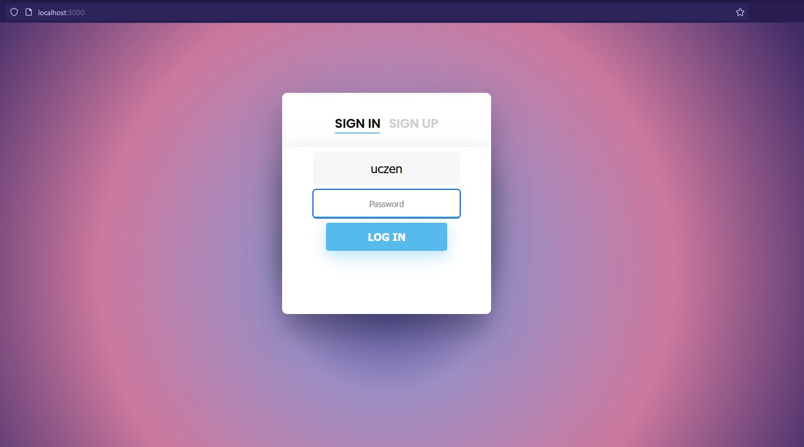
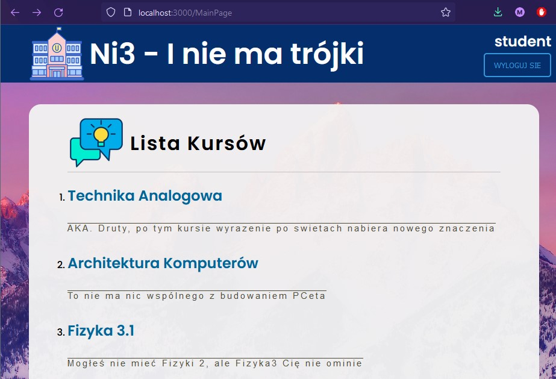
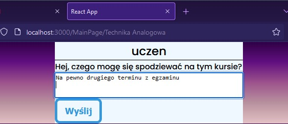
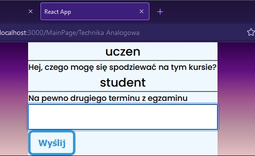

# Ni3

Serwis z komentarzami na temat kursów PWr

## Technologie

### frontend

- JavaScript
- framework React

### backend

- C#
- .net ef core, RESTapi, baza danych SQL

## Zrzuty ekranu z działania programu

### Ekran logowania i rejestracji użytkownika

### Ekran z listą kursów

### Ekran z sekcją komentarzy do kursu

#### przed dodaniem komentarza

#### po dodaniu komentarza

